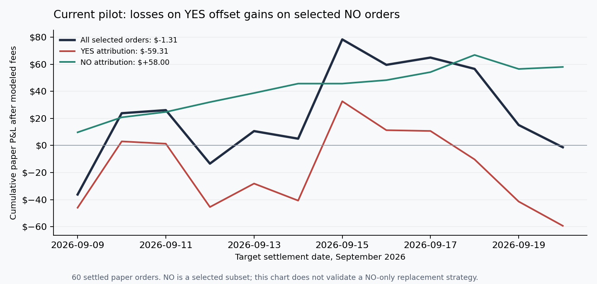

# Independent alpha validation and execution-accounting follow-up

This extends the [initial audit](2026-09-21-alpha-audit.md) on the same canonical September 21
capture and pilot-ledger hashes. No new market outcomes arrived during the investigation.
The user confirmed the losses in question are dashboard/paper P&L.

**No replacement strategy has demonstrated reliable forward alpha.** The strongest concrete
finding is regime drift: the warm correction that supported the original market-shape model
has disappeared in the recent sample. Several plausible changes make a retrospective profit,
but none has a settlement-day confidence interval clearly above zero under the inherited
pilot selection policy. They remain research candidates, not promoted trading rules.

The September 15 peak subsequently disappeared. The side curves are attribution within the
existing selected orders, not independently selected strategies or account returns.

## Independent check of the NO candidate

| Capture-time policy | Through September 7 | After September 7 |
|---|---:|---:|
| Rank both sides, retain selected NO | 60 orders; +18.44% | 21 orders; +10.02% |
| Filter NO first, select top five | 143; +13.83% | 57; −1.14% |
| Additional NO admitted by backfilling | 83; +10.49% | 36; −7.65% |
| All eligible NO, $15 each, ticker deduplicated | 252; +10.68% | 104; −3.58% |

Rank-first NO replay earns $30.90 after September 7, with a settlement-day bootstrap 95% ROI
interval of **−12.91% to +27.39%**. The actual ledger's selected NO orders earned $58, but
16 contracts common to both account for $50.17 in the ledger and $49.75 in the replay.
Nearly all the difference comes from which contracts were selected, rather than slight price
changes. Two losing capture-time selections are absent from the later pilot scan.

The exact parent-selected NO shadow remains the prospective definition, with no replacement
orders. Its post-September-21 sample is still empty. Choosing this subset after inspecting
the data means earlier returns cannot be called independent validation of that new rule.

## Regime drift explains why the original correction is suspect

On uncensored complete Kalshi ladders, realized high minus the market-implied mean was:

- **Before September 8:** +0.266°C; target-day bootstrap 95% interval +0.182°C to +0.352°C.
- **After September 7:** −0.014°C; interval −0.154°C to +0.120°C.

The causal joint fit still adds +0.2°C to +0.3°C. Across 180 complete resolved ladders in the
recent window, the joint correction worsens summed cell Brier score relative to the
uncorrected market-normal fit by **0.02787 per ladder**, paired target-day interval
**+0.00073 to +0.05409**. This is evidence against continued confidence in the old correction,
not proof that removing it creates tradable profit. Weather-model mean forecasts still trail
the market mean in recent RMSE: 1.159°C versus 0.883°C.

## Test the previously specified alternatives, not a tuned parameter sweep

Commit `14a1898` already included bias-only `(b, 1)` and scale-only `(0, k)` families in
`scripts/market_shape_alpha.py` on September 7. Each family below refits its own parameter
using earlier target dates; it does not merely remove one parameter from the joint fit.

The original script evaluated **all eligible cells at a 3% net-edge threshold**, with a
per-contract fee curve. Its previously specified forward comparisons are:

| Original family after September 7 | Cells | ROI | Target-day 95% interval |
|---|---:|---:|---:|
| Bias only, refitted | 167 | −7.29% | −22.27% to +8.33% |
| Scale only, refitted | 95 | +4.92% | −9.81% to +23.03% |

Combining these families with the separate pilot's 1% buffer, top-five ranking, integer $15
stakes and $30 city/target cap creates a different selection policy. These combinations have
not been prospectively paper-traded and must be labeled exploratory:

| Inherited pilot selection after September 7 | Orders | Net P&L | ROI | Target-day 95% interval |
|---|---:|---:|---:|---:|
| Joint fit, current policy replay | 60 | +$2.24 | +0.25% | −24.31% to +27.29% |
| Bias only, refitted | 58 | +$231.35 | +26.89% | −22.46% to +80.67% |
| Scale only, refitted | 47 | +$197.61 | +28.53% | −1.51% to +71.41% |

Each one-parameter pilot variant makes money in eight cities and loses in seven. A one-cent
adverse fill sensitivity leaves +$195.36 for bias-only and +$181.44 for scale-only. Dropping
the best city leaves +$104.80 and +$60.25 respectively. These are useful robustness checks,
but removing the best two cities turns both negative (−$13.11 and −$21.03).
The wide intervals, small date sample, selection changes and lack of actual fills still
prevent promotion. Several correlated experiments were inspected; nominal intervals are
not adjusted for that selection. Much of their profit is YES-side, which also rules out a
simple claim that all YES betting is intrinsically bad.

Reproduce the family comparisons with `python3 scripts/market_shape_validation.py`.

## Outcome-free ladder arbitrage search

An independent search covered **767 exact, exhaustive Kalshi partitions** at lead ≥1.
It required every purchased quote, contiguous intervals with both tails, no duplicate markets,
and equal integer contracts on every leg. It charged rounded fees per leg, included them in
the stake cap, and exhaustively checked affordable quantities.

There were 74 gross-positive baskets, two positive before fee rounding, and only one positive
after sizing and rounded fees: Denver captured September 15 for September 16.

| Budget including fees | Contracts per leg | Total cost | Net basket P&L | One leg fills 1¢ worse |
|---|---:|---:|---:|---:|
| $15 | 13 | $12.99 | +$0.01 | −$0.13 |
| $150 | 150 | $149.65 | +$0.35 | −$1.25 |

The higher-budget stress also exceeds its budget. Captures lack simultaneous timestamps and
depth for every leg, so these pennies do not establish executable arbitrage. No basket trades
were placed. Reproduce with `python3 scripts/ladder_arbitrage_audit.py --budgets 15 150`.

## Data hygiene findings

No duplicate market/capture keys, crossed quotes, revised outcomes, wrong Kalshi units, ticker
date mismatches or malformed bucket bounds were found. All 799 Kalshi ladders accepted by the
current completeness heuristic are also exact partitions; the 731 resolved lead ≥1 ladders
are distinct city/target events. Recent losses persist even on fully two-sided books.

Git history reveals a smaller historical availability issue: prior target dates sometimes had
outcomes first recorded several days later. Reconstructing first observation across 79 capture
commits changes the full joint replay ROI from 8.86% to 8.66%, affects six July parameter fits,
and has no September effect. True settlement-publication timestamps still are not stored.
Also, 13 partial Polymarket ladders pass the loose completeness heuristic; the current
Kalshi-only restriction prevents them entering this strategy. Neither issue explains recent
Kalshi losses, and neither was used to claim a new profit opportunity.

## Execution-accounting defects corrected before any live validation

The current official Kalshi API returns `initial_count_fp`, `remaining_count_fp`,
`fill_count_fp`, and fill `count_fp` fields. The old client ignored these fields, silently
dropped modern fill rows, then converted unknown filled counts to zero. An executed losing
order could therefore become a permanent `unfilled` ledger row and disappear from losses.
Schema references: [Get Order](https://docs.kalshi.com/api-reference/orders/get-order) and
[Get Fills](https://docs.kalshi.com/api-reference/portfolio/get-fills).

The client now reads integer-valued modern fields and authoritative filled counts, paginates
account lists, and rejects malformed or unsupported fractional-contract/subcent data instead
of truncating or discarding it. Cancellation cannot imply execution from a cleared remainder.
This client still intentionally supports only integer contracts and whole-cent prices.

A verified reconciliation now requires a terminal matching order, a reliable filled count,
unique matching fill identities, and full agreement between the count and actual fill details.
Missing, failed, partial or conflicting evidence stays pending and blocks live admission.
Python validates the verdict against its original order; a later zero-fill row can no longer
overwrite a realized loss. Legacy fallback verdicts lack the verification marker and are
re-queried. Unknown legacy orders older than the 14-day recent-order window require explicit
historical/manual reconciliation; they remain blocked rather than being silently discarded.

No funded accounts were accessed and no orders were placed. Live fees remain modeled rather
than reconciled from actual exchange fee fields, a limitation already recorded in the first
audit. Admission has not passed and the real-money path is not claimed to be production-proven.
