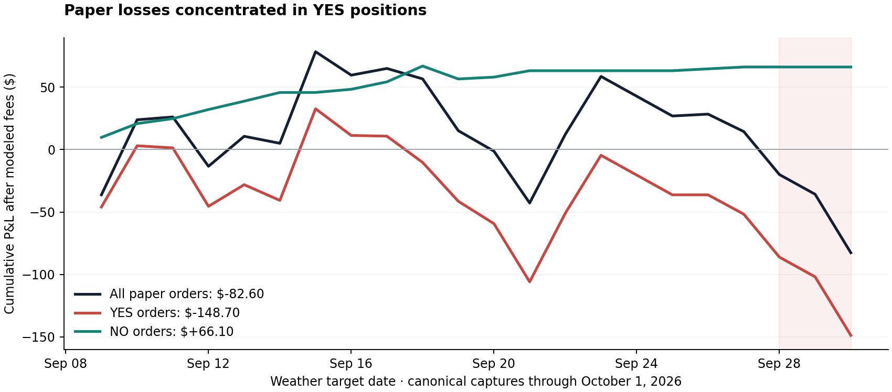

# Strategy recovery: stop the drawdown and test a simpler probability model

The repo supports a historically profitable replacement candidate, but does not yet demonstrate
reliable forward profitability. The preferred paper candidate is **scale-only market calibration**:
keep the market-implied temperature mean and learn only its uncertainty. The existing forecast
APIs were evaluated too; their added signal remains weak. New candidates stay separate from the
original pilot and cannot place live orders.

## What actually changed

Canonical input commit is `096fa88` (October 1), with 10,767 capture rows. The original checkout's
uncommitted capture/dashboard are a separate vintage and remain untouched. This investigation
uses the clean recovery worktree and preserves the canonical capture and pilot ledger bytes.

The active paper pilot trades **Kalshi**, despite the repository's Polymarket name. Its actual
market-shape rule was introduced in `14a1898` on September 7 and did not change during the last
three losing target dates. Recent commits primarily audited outcomes and repaired research
collection. The source file's strategy logic is unchanged; this patch adds risk controls.

There are two distinct historical profit stories:

1. Before the September 7 correction (`408e1e1`), missing-bid books could be sold at a fake 50-cent
   price. All 133 affected rows appeared to win. Restoring that code would restore phantom profits.
2. The later market-shape strategy had profitable clean historical replay. Its temperature
   correction then deteriorated: realized high minus market-implied mean was +0.266°C before
   September 8 and approximately −0.001°C afterward. A correction that helped the earlier regime
   was no longer supported in the newer sample. This is evidence of drift, not proof that every
   recent losing order was caused by that correction.

## Actual paper ledger

All recorded orders remain paper intentions, not verified exchange fills. Fees use the existing
conservative rounded Kalshi taker model. [Machine-readable audit](2026-10-01-pilot-audit.json).

| Actual selected orders | Settled | Net after modeled fees |
|---|---:|---:|
| Market-shape total | 81 | **−$82.60** |
| YES | 58 | −$148.70 |
| NO | 23 | +$66.10 |

The total includes $1,196.02 principal and $44.58 fees: −6.91% ROI, with a target-day bootstrap
95% interval of −32.18% to +21.16%. Targets September 28–30 lost **$97.02 across eight YES orders**.
Three October 1 positions remain open: Philadelphia NO $14.91, Austin NO $14.94, Boston YES $14.82.
They are excluded from settled P&L.



NO attribution cannot simply be treated as a new strategy's return. Filtering before ranking and
backfilling YES slots changes which contracts are selected. The exact September 21 frozen shadow
keeps already-selected NO orders without replacement; it has only two settled Seattle wins,
+$2.98, plus two open orders with $29.85 principal. That small, concentrated sample remains weak.

## Concrete replacement candidate

`scripts/weather_challenger.py` implements five fixed families under one shared selector. The
scale-only family uses the existing market-normal fit and original scale grid, with bias fixed at
zero. This avoids assuming that the market still systematically underpredicts the high. It can
buy either side when the calibrated probability clears the executable quote and all modeled costs.

The shared rules are fixed rather than optimized against returns:

- Use the earliest qualifying lead ≥1 capture of each city/target event. Require an exact,
  exhaustive bucket partition, valid book sides, and coherent total reference probability.
- Fit on at least 60 prior eligible events, capped at the latest 300. Distinct city/day events,
  rather than repeated snapshots, form training units.
- Learn each family's parameters independently. Scale-only minimizes categorical Brier loss
  over the original 0.60–1.20 scale grid. It does not shift the market mean.
- Require at least four cents expected edge per contract after integer-order rounded fees.
  Purchased contract price must be at least ten cents. Missing executable sides are skipped.
- Spend at most $15 **including fees** per order, one position per city/target and five per day.
  Outcomes never participate in ranking or capacity decisions. No Kelly compounding.
- Prefer observed outcome receipt dates strictly before the entry date. Legacy history uses an
  explicit target-plus-two-day availability approximation; it cannot prove actual publication time.

The weather challenger uses the already-captured station forecast minus market mean, with strong
ridge shrinkage and a 25% maximum weather weight. Its current fitted weight is only **2.47%**.
Weather dispersion is calibrated with categorical Brier loss on all eligible outcomes, including
tail winners. Its regression mean still approximates interior winners by bucket midpoints.

## Results under identical new selection rules

These dates were already inspected before this study. Parameter fits are chronological, but the
experiment and preferred family are **retrospective development**, not an untouched holdout.
The new selector differs from the actual pilot and older family replay; their totals must not be
mixed. [Study summary](2026-10-01-challenger-study.json),
[unchanged older-policy comparison](2026-10-01-family-audit.json).

| Fixed family | Entries after September 7 | Net | Entries after September 21 | Net |
|---|---:|---:|---:|---:|
| Unshifted market normal | 32 | +$37.79 | 6 | −$24.70 |
| Existing joint bias + scale | 89 | −$6.28 | 19 | −$79.85 |
| Independently fitted bias only | 80 | +$352.25 | 12 | −$10.67 |
| **Independently fitted scale only** | **68** | **+$220.05** | **12** | **+$12.55** |
| Weather blend | 93 | +$47.25 | 25 | −$39.33 |

Counts are settled selections in the stated capture-date window. Scale-only's post-September-7
return is **21.96% on $1,001.95 cumulative capital spent**, not account return. Its target-day
bootstrap interval is **−6.18% to +55.73%**. A one-cent worse entry, resized inside the same $15
budget with fees recalculated, leaves **+$187.31**. Removing its best city leaves +$103.68.
Across the full inspected history it earns +$350.91 on 218 orders, with a −2.13% to +26.27% ROI
interval. Its recent 12-order result is too small to resolve uncertainty and becomes negative
when the best city is removed. Historical maximum drawdown was $129.60; this is not low-risk income.

Bias-only makes more over the broad historical window but loses in the newest slice. Scale-only
is preferred for a paper trial because it removes the unsupported directional correction, not
because its return is guaranteed. The weather blend also loses in the newest slice. All five
families are retained so losing experiments cannot disappear from the record.

Previously registered June archive testing lost for all four older variants. The present study
does not overturn that result. Quotes are not fill evidence; simultaneous depth, slippage, actual
fee schedule and settlement-source compatibility still matter. Bootstrap intervals do not adjust
for selecting among experiments or serial dependence across days. No candidate passes admission.

## Fixes delivered

**Drawdown guard.** `kalshi_pilot` now defaults to `--max-drawdown 50`. It reconstructs the entire
strategy/mode realized curve from zero, groups by target date, and uses rounded modeled fees.
Current peak is +$78.34; current net is −$82.60; drawdown is **$160.94**. A credential-free dry run
of the new binary printed `STAND DOWN` before any new orders or ledger writes. Existing weekly
and live-admission gates remain. Reconciliation precedes the new-entry guard.

Unlike a rolling week, mere passage of time cannot clear this guard. Outstanding positive
settlements can reduce current drawdown, so it is not a permanent latch. Old capture files lack
settlement publication timestamps; target-day grouping is a deterministic accounting convention,
not a reconstruction of intraday account equity. Do not claim the counterfactual savings of a
historically replayed guard without reproducing outcome availability and open commitments.

**Outcome clocks.** New resolutions retain `outcome_observed_at`, the capture process's first
receipt time. Already resolved legacy rows remain unknown. Subsequent rewrites preserve recorded
timestamps. This adds future evidence without inventing historical publication dates.

**Separate forward research.** The existing daily workflow emits hashed, paper-only selections for
all five challengers and uploads an immutable run/attempt artifact retained for 90 days. It requires
a fresh UTC capture date; failed/stale captures cannot silently generate a new day's signals.
Research failures do not suppress canonical capture, pilot risk handling or data commits.
The [October 1 local shadow](2026-10-01-challenger-shadow.json) is reconstructed development
evidence, not a deployed prospective sample. Fresh future artifacts after deployment start that
sample. They do not inherit the original pilot's order count or live authorization.

No live trading was enabled. No frozen source-study observations or canonical historical labels
were edited. These implementation changes require deployment before the hosted workflow uses them.

## Reproduce and verify

```sh
python3 scripts/pilot_alpha_audit.py
python3 scripts/market_shape_validation.py
python3 scripts/weather_challenger.py --output research-output/weather-study.json
python3 scripts/weather_challenger.py --shadow --require-capture-date 2026-10-01 \
  --output research-output/weather-shadow.json
python3 -m unittest discover -s tests -p 'test_*.py'
cargo test
```

Use the actual UTC date instead of the frozen reproduction date for future collection. Input
hashes and implementation hashes are included in JSON artifacts. The summary drops full selections
and fit paths for size; the command reproduces them. Rust tests pass, including drawdown scope,
day grouping, fee rounding and malformed evidence. Python tests include causal training,
future-outcome masking, partition gaps, missing quotes, fee-inclusive sizing, tail dispersion
and stale-date rejection. The existing admission scorer continues to report NO-GO.

Polymarket data remains captured, but these full-ladder comparisons are Kalshi-specific and cannot
be transferred to Polymarket by changing a venue string. Its current official weather taker fee
schedule is also nonzero; historical gross/no-fee comparisons are not current net-return evidence.
See [Polymarket fee documentation](https://docs.polymarket.com/trading/fees) and
[Kalshi orderbook semantics](https://docs.kalshi.com/getting_started/orderbook_responses).
